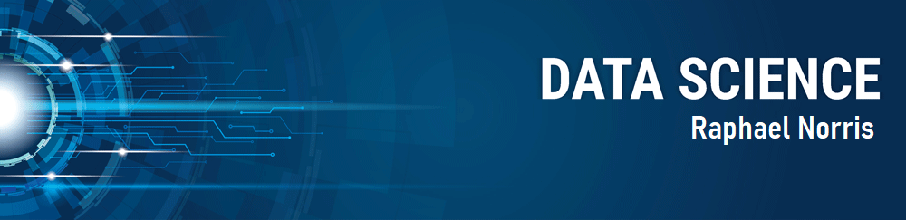

   

  

# Raphael Norris
*Matemático* explorando o universo dos dados.

Com as habilidades desenvolvidas pelo estudo da matemática pura e conhecimentos pedagógicos, eu combino o raciocínio matemático, habilidades analíticas e a capacidade de dinamizar o ensino e aprendizado, atrelado com uma curiosidade epistemológica.

Tenho formação pela Universidade Federal do Espírito Santo(UFES) em março de 2022. Atualmente faço um estudo aprofundando em Data Science, com foco em desenvolvimento de projetos. Fui apresentado a Data Science pelo curso *Data Science Math Skills* ofericido na *Duke University* no inicio da pandemia e motivado na universidade, busco diriamente conhecimentos em prol de uma formação integral.

**Background in:** Python, Machine Learning, Math skills.

**Links:**
* [LinkedIn](https://www.linkedin.com/in/raphael-norris-703a5a143/)

## Projetos:

---

